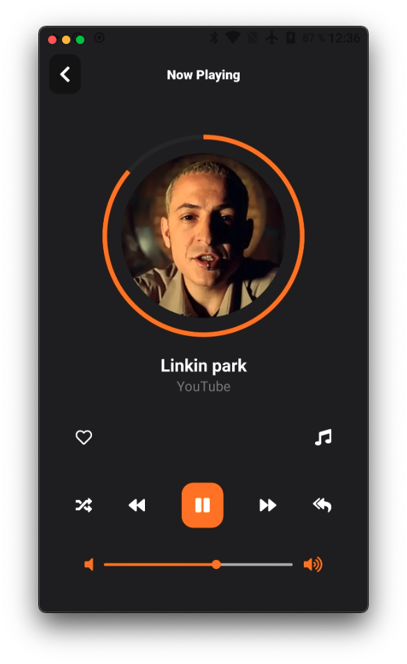

<div align="center">
    
</div>

# **Project in Development**

Bare React Native App for (iOs and Android) to stream music from YouTube.

## **Note**

Although the app runs for iOS and Android, it can only stream videos on Android devices. This is because in iOs it is not possible to reproduce from the link generated by the server. (I am looking for a way to solve this)

#### **What is using**

- react-navigation 5
- react-native-elements (UI library)
- react-native-track-player (Audio library)
- react-native-svg to handle Circle Slider
- momenjs for date handling
- react-native-url-polyfill as a work-around to support URL in React Native

#### **What is doing?**

- Search videos with suggestions from Google. (No api required)
- Search videos from Youtube. (No api required)
- Play audio in background (Only Android)

#### **Install Dependencies**

```script
npm install
```

### **Install dependencies for iOs**

```script
npx pod-install
```

### **Run project on Android**

```script
npx react-native run-android
```

### **To Do**

- Placeholder when image not found
- Save playlist in device storage

### **Know Bugs**

- **_This video requires payment to watch_** (Need to catch this error in useMediaPlayer)

### **Gallery**

<p float="left" align="center">
  
  
  
  
  
  
</p>
